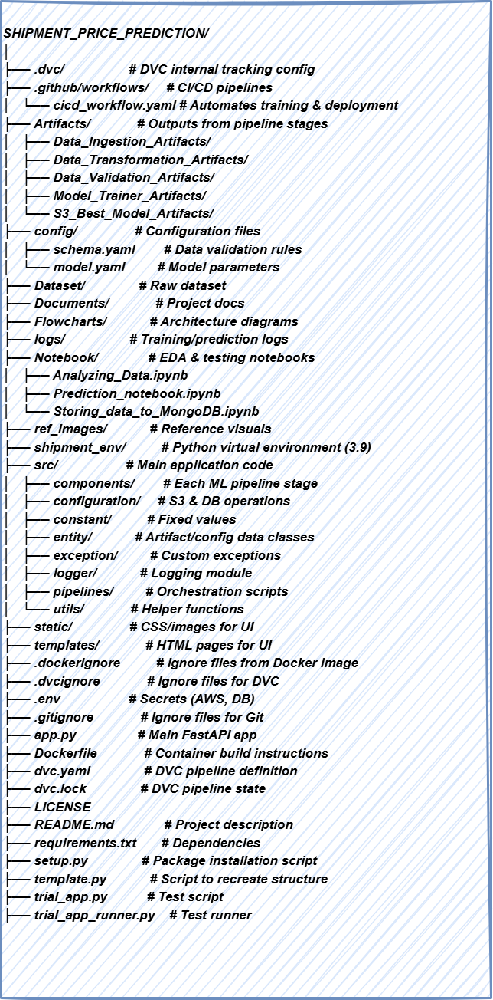
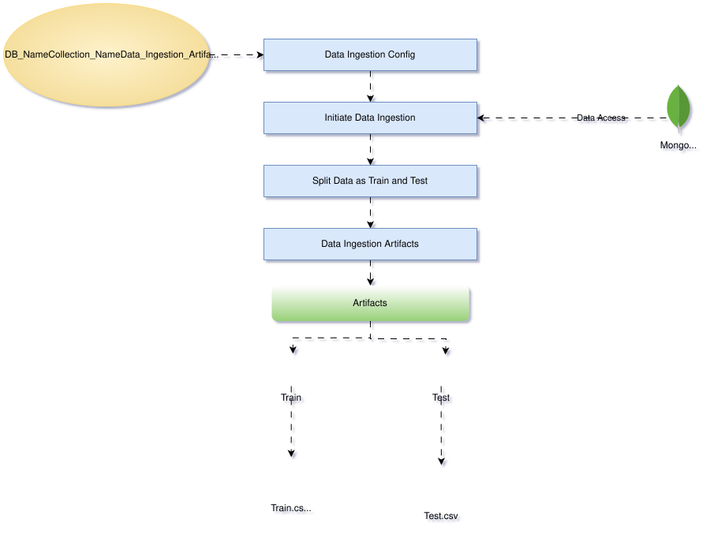
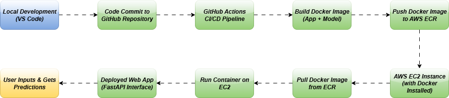
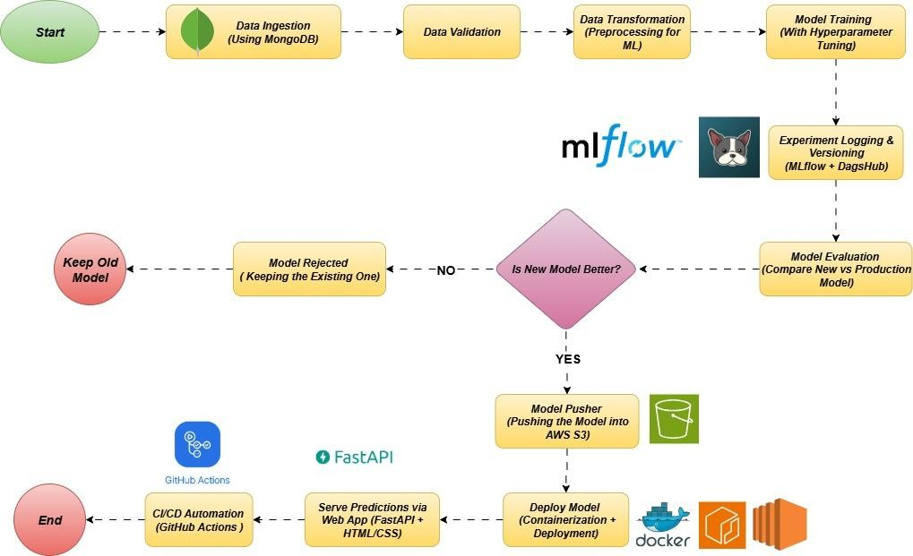
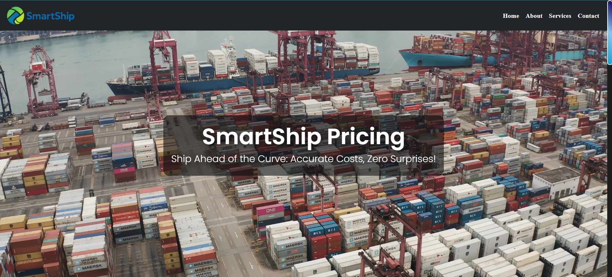
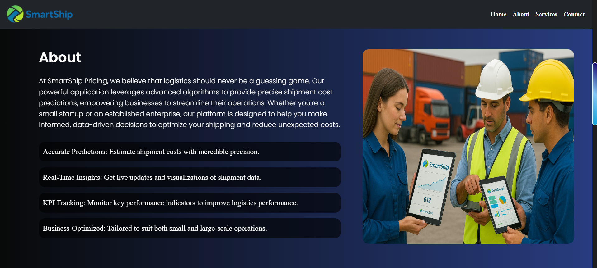
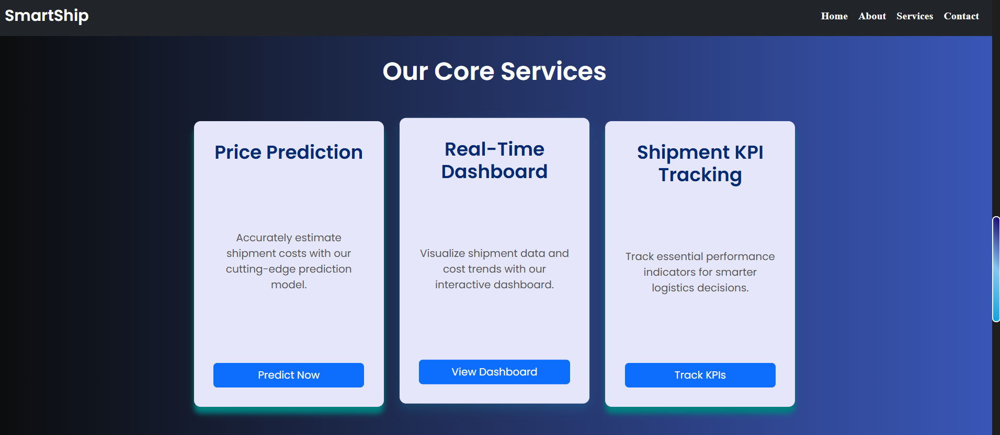
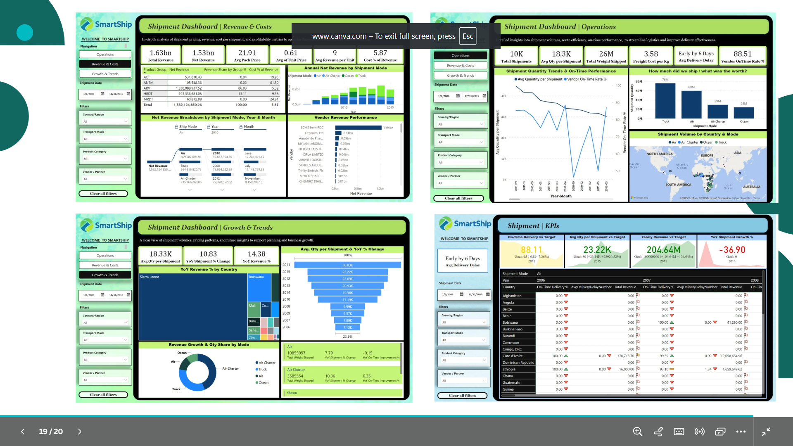

# 📦 **Shipment Price Prediction**  


----


---

## How to Use This Repository Locally

### 1. Clone the Repository  
Clone this repository to your local machine:
```bash
git clone https://github.com/rashmiKumari03/Shipment-Price-Prediction.git
cd Shipment-Price-Prediction
```

### 2. Create a Conda Environment  
Create a Conda environment with Python 3.9:
```bash
conda create -p shipment_env python==3.9 -y
```

### 3. Activate the Environment  
Activate the newly created environment:
```bash
conda activate shipment_env/
```

### 4. Install Required Packages  
Install the necessary dependencies:
```bash
pip install -r requirements.txt
```

### 5. Install IPykernel for Jupyter Notebook  
Install `ipykernel` to use Jupyter Notebook:
```bash
pip install ipykernel
```

---

This will set up the environment and install everything , need to run the project. 

-------

## **Table of Contents (High-Level Overview)**
| **Section**                                        | **Subsection**                                           |
|----------------------------------------------------|----------------------------------------------------------|
| **Introduction**                                   |                                                          |
|                                                    | Understanding the Problem                               |
|                                                    | Problem Description                                      |
|                                                    | Understanding the Application Scope                      |
|                                                    | Tour to Existing Solutions                               |
|                                                    | Problem Statement                                        |
|                                                    | Approach                                                  |
|                                                    | Dataset                                                  |
| **Understanding the Solution**                     |                                                          |
|                                                    | Solution Description                                     |
|                                                    | Notebook Walkthrough                                     |
|                                                    | Tour to Architecture                                     |
|                                                    | Cost Involved                                            |
| **Code Architecture Understanding**                |                                                          |
| **Deployment Strategy**                            |                                                          |
| **About Data: SCMS Historical Data for Shipment Price Prediction** |                      |
|                                                    | Business Insights                                        |
|                                                    | How Logistics Companies Can Use Shipment Price Prediction |
| **Conclusion**                                     |                                                          |

---------
## 🌟 **Project Overview** 

### 🖥️1. **Introduction**

#### 🎯**What is Shipment Price Prediction?**

Shipment price prediction is a process where machine learning models are used to estimate the cost of shipping goods based on various factors such as weight, distance, mode of transportation, fuel prices, traffic conditions, and delivery deadlines. In simpler terms, it helps logistics companies determine how much it will cost to ship a product before it is actually shipped, ensuring both profitability and fairness for customers. For example, if you're shipping a package from one city to another, factors like how heavy the package is, the distance between the cities, and the shipping mode (air, land, or sea) all influence the price.

-----

### 🧠2. **Understanding the Problem**

#### 🎯**Problem Description**

The shipment pricing model faces complexities due to fluctuating factors such as fuel prices, varying traffic conditions, delivery deadlines, and route complexities. Traditional pricing models tend to be static, unable to adjust dynamically based on these real-world variables. The main challenge lies in predicting accurate pricing while accounting for these dynamic elements. By improving the accuracy of the price prediction, companies can achieve fair pricing, optimize costs, and enhance their operational efficiency.

#### 🎯**Understanding the Application Scope**

The shipment price prediction model can be applied to various types of logistics businesses, from small local delivery services to large international freight operations. It is useful for businesses that need to accurately predict costs for shipping products from one place to another. The scope of this application extends to dynamic pricing based on changing market conditions, providing cost-effective solutions for both customers and logistics companies. This can improve revenue prediction, customer satisfaction, and operational efficiency.

#### 🎯**Tour to Existing Solutions**

Traditional shipment pricing models are based on predefined rates for specific distances, weights, and delivery methods. However, these models don't account for real-time fluctuations in variables such as fuel prices, traffic conditions, or urgent delivery requests. Machine learning provides a dynamic solution to this problem by learning from past data and predicting shipment prices based on a combination of factors. Current solutions may be overly simplified or not sufficiently dynamic to handle the complexity of real-world logistics operations.

#### 🎯**Problem Statement**

The supply chain analytics market is growing at an expected Compound Annual Growth Rate (CAGR) of 17.3% from 2019 to 2024, reflecting the increasing need for accurate predictive models in supply chain management. Logistics companies need the ability to predict shipment prices with a high degree of certainty in order to optimize their pricing strategies, reduce costs, and enhance service levels. This project aims to predict shipment prices based on available factors such as weight, delivery deadlines, mode of transport, and other key logistics variables.

#### 🎯**Approach**

Classical machine learning pipeline:
1. **Data Exploration:** Analyzing the dataset to understand the underlying patterns.
2. **Data Cleaning:** Handling missing values and correcting inconsistencies in the data.
3. **Feature Engineering:** Identifying and creating new features that contribute to the price prediction.
4. **Model Building:** Training different machine learning models and comparing their performance.
5. **Model Testing:** Evaluating the models to select the best one for accurate predictions.

#### 🎯**Dataset**

The dataset for this project is the [Supply Chain Shipment Pricing Data](https://www.kaggle.com/datasets/divyeshardeshana/supply-chain-shipment-pricing-data), which includes features like weight, shipment mode, freight cost, and other essential factors. This dataset will be used to train and test machine learning models for predicting shipment prices.

---

### 💡3. **Understanding the Solution**

#### 🎯**Solution Description**

The solution revolves around building a machine learning model that can predict shipment prices by considering a variety of factors. By using historical shipment data, the model learns the patterns between the features (e.g., weight, distance, fuel costs) and the target variable (shipment price). The model will then be used to predict prices for future shipments based on new inputs. This dynamic approach will allow logistics companies to adjust their prices based on real-time data, ensuring they are competitive while maintaining profitability.

#### 🎯**Notebook Walkthrough**

The solution starts with data preprocessing and feature engineering, followed by the application of various machine learning models. In this section of the project, the notebook will demonstrate:
- Data cleaning techniques (e.g., handling missing values).
- Feature extraction (e.g., calculating distances or estimating delivery deadlines).
- Model training using algorithms such as Random Forest, XGBoost, and Neural Networks.
- Evaluation of models based on metrics such as RMSE (Root Mean Squared Error) and R-squared.


#### 🎯**Tour to Architecture**

The architecture consists of:
1. **Data Ingestion:** A pipeline that fetches and preprocesses raw data.
2. **Feature Engineering:** Extracting important features for model training.
3. **Model Training and Evaluation:** Using different machine learning algorithms to predict shipment prices.
4. **Experiment Tracking & Data Versioning:** Using mlflow and DagsHub for the experiment tracking and DVC for data versioning.
4. **Deployment:** Deploying the trained model into a production environment where it can be used to predict prices in real-time.

The architecture is modular and scalable, which means new features and models can be easily integrated in the future.

#### 🎯**Cost Involved**

The primary costs involved in this project include:
- **Data Storage:** Cost of storing large datasets in cloud platforms like AWS.
- **Model Training:** Costs related to training machine learning models, especially if using powerful hardware or cloud-based resources.
- **Deployment:** Cost of cloud services for hosting the deployed model, including API services, server costs, and monitoring tools.

---

### ⚡4. **Code Understanding**

#### 🎯**Folder Structure Overview**




**Explanation:**
- **components:** Contains scripts for data handling (ingestion, validation, transformation), machine learning tasks (training, evaluation), and model deployment.
- **pipelines:** Automates training and prediction workflows.
- **frontend:** User interface components for interacting with the system.
- **configurations, constants:** Stores configurations and constants used throughout the project.
- **utils, logger, exception:** Includes utility functions, logging, and error handling to improve maintainability.


-----------------------------------------------------------------------------------

## FlowCharts:

### 1. DATA INGESTION PIPELINE



## Creation:


-------------------------------------



-------------------------------------



------------------------------------



------------------------------------



------------------------------------




## 🚀 **Deployment Strategy**

### **Tools and Platforms**
- **Cloud Platform:** AWS to host the application, ensuring scalability and high availability.
- **Version Control:** GitHub for collaboration and continuous integration.
- **Containerization:** Docker to ensure consistency in different environments and simplify deployment.

### 🎯**Deployment Steps**
1. **Create IAM Roles** for secure access to AWS services.
2. **Set Up ECR** (Elastic Container Registry) to store Docker images.
3. **Launch EC2 Instances** for hosting the application.
4. **Use GitHub Actions** to automate the build and deployment pipeline.
5. **Monitor with MLflow** for model performance tracking and experiment management.

### **Why Docker?**  
Docker ensures that the application will run seamlessly across development, testing, and production environments, improving deployment reliability.

---


ABOUT DATA
## 📜 **SCMS Historical Data for Shipment Price Prediction**  

### 🎯**What is SCMS?**  
The Supply Chain Management System (SCMS) is an integrated framework that helps manage and optimize supply chain activities such as procurement, inventory, and logistics. The dataset focuses on shipment pricing, which is a critical factor influencing the efficiency and profitability of the supply chain.

### **Dataset Overview**  
The SCMS dataset provides historical data on shipment pricing for a variety of products, helping to identify key factors that influence prices and optimize the supply chain.

#### **Columns Overview**  

| **Column Name**            | **Description**                                                                 |
|----------------------------|-------------------------------------------------------------------------------|
| ID                         | Unique identifier for each shipment record.                                   |
| Project Code               | Code representing the specific project.                                       |
| PQ #                       | Prequalification number indicating the shipment stage.                        |
| PO / SO #                  | Purchase Order or Sales Order number.                                         |
| ASN/DN #                   | Advanced Shipment Notification or Delivery Note number.                       |
| Country                    | Destination country of the shipment.                                          |
| Managed By                 | Entity responsible for managing the shipment.                                 |
| Fulfill Via                | Fulfillment method (e.g., Direct Drop).                                       |
| Vendor INCO Term           | International Commercial Terms defining buyer-seller responsibilities.        |
| Shipment Mode              | Mode of transportation (e.g., Air, Sea, Land).                                |
| PQ First Sent to Client Date | Date when the prequalification process began with the client.               |
| PO Sent to Vendor Date     | Date when the purchase order was sent to the vendor.                          |
| Scheduled Delivery Date    | Planned delivery date of the shipment.                                        |
| Delivered to Client Date   | Actual delivery date to the client.                                           |
| Delivery Recorded Date     | Date when delivery details were recorded.                                     |
| Product Group              | Broad category of the product.                                               |
| Sub Classification         | Subcategory of the product.                                                  |
| Vendor                     | Supplier or manufacturer of the product.                                      |
| Item Description           | Description of the shipped item.                                             |
| Molecule/Test Type         | Active ingredient or test type of the product.                               |
| Brand                      | Brand name of the product.                                                   |
| Dosage                     | Dosage strength of the product.                                              |
| Dosage Form                | Physical form (e.g., Tablet, Capsule).                                        |
| Unit of Measure (Per Pack) | Quantity in each pack.                                                       |
| Line Item Quantity         | Total units in the shipment line item.                                       |
| Line Item Value            | Total value of the shipment line item (USD).                                 |
| Pack Price                 | Cost per pack (USD).                                                         |
| Unit Price                 | Cost per unit (USD).                                                         |
| Manufacturing Site         | Location of product manufacturing.                                           |
| First Line Designation     | Indicates if the product is a first-line medication (Yes/No).                |
| Weight (Kilograms)         | Total weight of the shipment (kg).                                           |
| Freight Cost (USD)         | Transportation cost of the shipment.                                         |
| Line Item Insurance (USD)  | Insurance cost associated with the shipment line item.                       |

This dataset is invaluable for building predictive models to improve shipment pricing accuracy and efficiency.

---

## 💼 **Business Insights**  

### **What is Shipment Price Prediction?**  
Shipment price prediction is the process of using historical data and various logistic factors (such as distance, weight, fuel prices, and delivery deadlines) to forecast the cost of shipping a product. It helps businesses optimize their pricing strategies, reduce operational costs, and provide customers with fair and transparent pricing.

### **What is SCMS?**  
SCMS (Supply Chain Management System) is an integrated system that helps organizations manage their supply chain processes. It includes everything from procurement to delivery and helps optimize logistics, inventory, and shipment pricing.

### 🎯**Business Problem Statements to Address**  
Using this dataset, logistics companies can address several key business problems:  
1. **Optimizing Pricing Models:** Predict shipment costs dynamically, considering changing factors like fuel prices, traffic, and route conditions.  
2. **Reducing Operational Costs:** Forecasting accurate pricing helps avoid cost overruns by optimizing resource allocation.  
3. **Improving Customer Satisfaction:** Providing accurate and transparent pricing helps build customer trust and satisfaction.  
4. **Streamlining Logistics Operations:** Efficient pricing models help optimize routes, delivery deadlines, and resources.

### 🎯**Further Aim**  
- **Aim:** To develop a machine learning model that predicts shipment pricing based on dynamic logistic variables.
- **Columns Needed:** Distance, Weight, Delivery Deadlines, Freight Costs, Mode of Shipment, Country, and more.  
- **Problem Statement Solved:** The model addresses the variability in shipment pricing, providing real-time forecasts.  
- **Business Benefits:** Businesses can optimize their shipment pricing strategy, reduce costs, and offer better services to customers.

### 🎯**Prerequisites**  
- Basic understanding of machine learning and data preprocessing.  
- Familiarity with Python libraries like Pandas, Scikit-learn, and XGBoost.

---

## 🛠️ **How Logistics Companies Can Use Shipment Price Prediction**  

Logistics companies can use shipment price prediction to:  
- **Improve Pricing Strategies:** Accurately forecast shipping costs based on real-time factors like fuel prices and delivery deadlines.  
- **Optimize Resources:** Streamline logistics planning, minimizing idle time and reducing operational costs.  
- **Enhance Customer Satisfaction:** Offer customers accurate, transparent pricing, enhancing customer trust and retention.

This tool will solve critical problems for logistics companies, helping them stay competitive in the rapidly evolving supply chain industry.

---

## 📜 **Conclusion**

The Shipment Price Prediction model can revolutionize the way logistics companies handle shipment pricing by using machine learning to make predictions based on real-time data. This dynamic pricing model will help optimize operational costs, improve customer satisfaction, and enhance business profitability. The modular code architecture and scalable deployment strategy ensure that the solution can grow and adapt as the business needs evolve.

